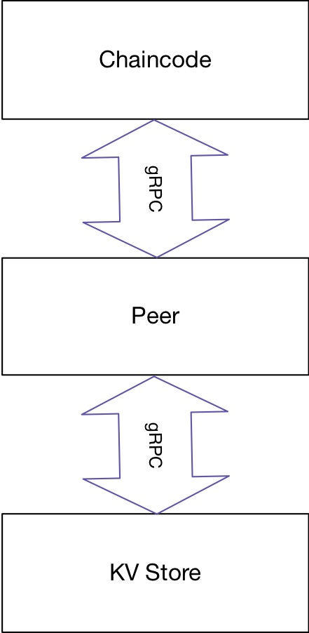

# gRPC Based VersionDB Connector

Right now, Hyperledger Fabric only supports LevelDB and CouchDB as its state db. To support other database backend, I added a new VersionDBProvider and VersionDB implementation which will delegate the read/write call from peer node to the actual database through gRPC call.

To actually handle the read/write requests, we should provide a gRPC server which implements the following gRPC Protocol. [gRPC Protocol](core/ledger/util/concorddb/msgs/concord.proto)

Take this code as an example, which used Redis as a statedb. [gRPC Server with Redis as Backend](https://github.com/nickcen/concord_grpc/blob/master/concord_server.go)

